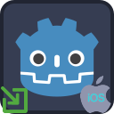

<p align="center">
	
	&nbsp;&nbsp;&nbsp;&nbsp;&nbsp;&nbsp;
	
</p>

---

#  Godot Deeplink Plugin

Deeplink plugin provides a unified GDScript interface for processing of App Links on the Android platform and Universal Links on the iOS platform in order to enable direct navigation to specific app content.

_This plugin has been moved under the umbrella of [Godot SDK Integrations](https://github.com/godot-sdk-integrations) organization in Github. Previously, the plugin was placed under three separate repositories: [Android](https://github.com/cengiz-pz/godot-android-deeplink-plugin), [iOS](https://github.com/cengiz-pz/godot-ios-deeplink-plugin), and [addon interface](https://github.com/cengiz-pz/godot-deeplink-addon)._

<br/>

##  Installation
_Before installing this plugin, make sure to uninstall any previous versions of the same plugin._

_If installing both Android and iOS versions of the plugin in the same project, then make sure that both versions use the same addon interface version._

There are 2 ways to install this plugin into your project:
- Through the Godot Editor's AssetLib
- Manually by downloading archives from Github

<br/>

###  Installing via AssetLib
Steps:
- search for and select the `Deeplink` plugin in Godot Editor
- click `Download` button
- on the installation dialog...
	- keep `Change Install Folder` setting pointing to your project's root directory
	- keep `Ignore asset root` checkbox checked
	- click `Install` button
- enable the plugin via the `Plugins` tab of `Project->Project Settings...` menu, in the Godot Editor

<br/>

####  Installing both Android and iOS versions of the plugin in the same project
When installing via AssetLib, the installer may display a warning that states "_[x number of]_ files conflict with your project and won't be installed." You can ignore this warning since both versions use the same addon code.

<br/>

###  Installing manually
Steps:
- download release archive from Github
- unzip the release archive
- copy to your Godot project's root directory
- enable the plugin via the `Plugins` tab of `Project->Project Settings...` menu, in the Godot Editor

<br/><br/>

##  Usage
- Add `Deeplink` nodes to your scene per URL association and follow the following steps:
	- set the required field on each `Deeplink` node
		- `scheme`
		- `host`
		- `path prefix`
	- note that `scheme`, `host`, and `path prefix` must all match for a URI to be processed by the app
		- leave `path prefix` empty to process all paths in `host`
- register a listener for the `deeplink_received` signal
	- process `url`, `scheme`, `host`, and `path` data from the signal
- invoke the `initialize()` method at startup
- alternatively, use the following methods to get most recent deeplink data:
	- `get_link_url()` -> full URL for the deeplink
	- `get_link_scheme()` -> scheme for the deeplink (ie. 'https')
	- `get_link_host()` -> host for the deeplink (ie. 'www.example.com')
	- `get_link_path()` -> path for the deeplink (the part that comes after host)
- additional methods:
	- `is_domain_associated(a_domain: String)` -> returns true if your application is correctly associated with the given domain on the tested device
	- `navigate_to_open_by_default_settings()` -> navigates to the Android OS' `Open by Default` settings screen for your application

<br/>

###  File-based Export Configuration
In order to enable file-based export configuration, an `export.cfg` file should be placed in the `addons/DeeplinkPlugin` directory. The `export.cfg` configuration file may contain multiple deeplink configurations. The `scheme` and `host` properties are mandatory for each deeplink configuration.

The following is a sample `export.cfg` file:

```
[Deeplink1]
scheme = "https"
host = "www.example.com"

[Deeplink2]
scheme = "https"
host = "www.example2.com"
```

Example `export.cfg` file with Android-specific properties:

```
[Deeplink3]
label = "deeplink1"
is_auto_verify = true
is_default = true
is_browsable = true
scheme = "https"
host = "www.example.com"
path_prefix = "/my_data"
```

<br/>

###  Node-based Export Configuration
If `export.cfg` file is not found or file-based configuration fails, then the plugin will attempt to load node-based configuration.

During iOS export, the plugin searches for `Deeplink` nodes in the scene that is open in the Godot Editor. If none found, then the plugin searches for `Deeplink` nodes in the project's main scene. Therefore; 
- Make sure that the scene that contains the `Deeplink` node(s) is selected in the Godot Editor when building and exporting for Android, or
- Make sure that your Godot project's main scene contains an `Deeplink` node(s).

<br/><br/>

---

#  Android Deeplink Plugin

<p align="center">
	
</p>


## [Android-specific Documentation](android/README.md)
## [AssetLib Entry](https://godotengine.org/asset-library/asset/2534)

<br/><br/>

---

#  iOS Deeplink Plugin

<p align="center">
	
</p>

## [iOS-specific Documentation](ios/README.md)
## [AssetLib Entry](https://godotengine.org/asset-library/asset/3191)

<br/><br/>

---
#  All Plugins

| Plugin | Android | iOS |
| :---: | :--- | :--- |
| [Notification Scheduler](https://github.com/godot-sdk-integrations/godot-notification-scheduler) | ✅ | ✅ |
| [Admob](https://github.com/godot-sdk-integrations/godot-admob) | ✅ | ✅ |
| [Deeplink](https://github.com/godot-sdk-integrations/godot-deeplink) | ✅ | ✅ |
| [Share](https://github.com/godot-sdk-integrations/godot-share) | ✅ | ✅ |
| [In-App Review](https://github.com/godot-sdk-integrations/godot-inapp-review) | ✅ | ✅ |

<br/><br/>

---
#  Credits

Developed by [Cengiz](https://github.com/cengiz-pz)

iOS part is based on: [Godot iOS Plugin Template](https://github.com/cengiz-pz/godot-ios-plugin-template)

Original repository: [Godot Deeplink Plugin](https://github.com/godot-sdk-integrations/godot-deeplink)
