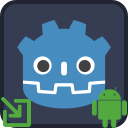

<p align="center">
	
</p>

---
#  Deeplink Plugin

Deeplink plugin allows processing of Android application links that enable direct navigation to requested app content.

<br/>

##  Prerequisites
Follow instructions on the following page to create a custom Android gradle build
- [Create custom Android gradle build](https://docs.godotengine.org/en/stable/tutorials/export/android_gradle_build.html)

Follow instructions on the following page to associate your Godot app with your website:
- [Associate your Godot app with your website](https://developer.android.com/studio/write/app-link-indexing#associatesite)

<br/>

##  Testing
`adb shell` command can be used to simulate app links as follows:
- `$> adb shell am start -a android.intent.action.VIEW -c android.intent.category.BROWSABLE -d "https://www.example.com/mydata/path"`

<br/><br/>

##  Android Export
- Make sure that the scene that contains your Deeplink nodes is selected in the Godot Editor when building and exporting for Android
	- Close other scenes to make sure
	- _Deeplink nodes will be searched in the scene that is currently open in the Godot Editor_
Android export requires several configuration settings.

###  File-based Export Configuration
In order to enable file-based export configuration, an `export.cfg` file should be placed in the `addons/DeeplinkPlugin` directory. The `export.cfg` configuration file may contain multiple deeplink configurations. The `scheme` and `host` properties are mandatory for each deeplink configuration.

The following is a sample `export.cfg` file:

```
[Deeplink1]
label = "deeplink1"
is_auto_verify = true
is_default = true
is_browsable = true
scheme = "https"
host = "www.example.com"
path_prefix = "/my_data"

[Deeplink2]
scheme = "https"
host = "www.example2.com"
```

###  Node-based Export Configuration
If `export.cfg` file is not found or file-based configuration fails, then the plugin will attempt to load node-based configuration.

During Android export, the plugin searches for `Deeplink` nodes in the scene that is open in the Godot Editor. If none found, then the plugin searches for `Deeplink` nodes in the project's main scene. Therefore; 
- Make sure that the scene that contains the `Deeplink` node(s) is selected in the Godot Editor when building and exporting for Android, or
- Make sure that your Godot project's main scene contains an `Deeplink` node(s).


##  Troubleshooting

### Unhandled Deeplinks
If your game is not handling your deeplinks, then make sure to revisit the [Android Export](#android-export) and [Prerequisites](#prerequisites) sections.

### ADB logcat
`adb logcat` is one of the best tools for troubleshooting unexpected behavior
- use `$> adb logcat | grep 'godot'` on Linux
	- `adb logcat *:W` to see warnings and errors
	- `adb logcat *:E` to see only errors
	- `adb logcat | grep 'godot|somethingElse'` to filter using more than one string at the same time
- use `#> adb.exe logcat | select-string "godot"` on powershell (Windows)

Also check out:
https://docs.godotengine.org/en/stable/tutorials/platform/android/android_plugin.html#troubleshooting

<br/><br/>
___

#  Contribution

This section provides information on how to build the plugin for contributors.

<br/>

___

##  Prerequisites

- [Install AndroidStudio](https://developer.android.com/studio)

<br/>
