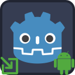
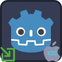

<p align="center">
	
	&nbsp;&nbsp;&nbsp;&nbsp;&nbsp;&nbsp;
	
</p>

---

#  Godot Deeplink Plugin

Deeplink plugin provides a unified GDScript interface for processing of App Links on the Android platform and Universal Links on the iOS platform in order to enable direct navigation to specific app content.

**Features:**
- Enable web links to directly access app content.
- Provide support for custom schemes.
- Check if a domain is associated with app.
- Forward users to related app settings on platform.

---

##  Table of Contents
- [Installation](#installation)
- [Usage](#usage)
- [Signals](#signals)
- [Export](#export)
- [Platform-Specific Notes](#platform-specific-notes)
- [Links](#links)
- [All Plugins](#all-plugins)
- [Credits](#credits)
- [Contributing](#contributing)

---

<a name="installation"></a>

##  Installation

**Uninstall previous versions** before installing.
If using both Android & iOS, ensure **same addon interface version**.

**Options:**
1. **AssetLib**
	- Search for `Deeplink`
	- Click `Download` → `Install`
	- Install to project root, `Ignore asset root` checked
	- Enable via **Project → Project Settings → Plugins**
	- Ignore file conflict warnings when installing both versions
2. **Manual**
	- Download release from GitHub
	- Unzip to project root
	- Enable via **Plugins** tab

---

<a name="usage"></a>

##  Usage
- Add `Deeplink` nodes to your scene per URL association and follow the following steps:
	- set the required field on each `Deeplink` node
		- `scheme`
		- `host`
		- `path prefix`
	- note that `scheme`, `host`, and `path prefix` must all match for a URI to be processed by the app
		- leave `path prefix` empty to process all paths in `host`
- register a listener for the `deeplink_received` signal
	- process `url`, `scheme`, `host`, and `path` data from the signal
- invoke the `initialize()` method at startup
- alternatively, use the following methods to get most recent deeplink data:
	- `get_link_url()` -> full URL for the deeplink
	- `get_link_scheme()` -> scheme for the deeplink (ie. 'https')
	- `get_link_host()` -> host for the deeplink (ie. 'www.example.com')
	- `get_link_path()` -> path for the deeplink (the part that comes after host)
- additional methods:
	- `is_domain_associated(a_domain: String)` -> returns true if your application is correctly associated with the given domain on the tested device
	- `navigate_to_open_by_default_settings()` -> navigates to the Android OS' `Open by Default` settings screen for your application
	
	---

<a name="signals"></a>

##  Signals

- `deeplink_received(url: DeeplinkUrl)`: Emitted when app content is requested via deeplink.

---

<a name="export"></a>

##  Export

Three options:

- Add `Deeplink` node to main scene
- Open scene with `Deeplink` nodes in the editor before export
- Use file-based export

1. **File-based Export Configuration**
In order to enable file-based export configuration, an `export.cfg` file should be placed in the `addons/DeeplinkPlugin` directory. The `export.cfg` configuration file may contain multiple deeplink configurations. The `scheme` and `host` properties are mandatory for each deeplink configuration.

The following is a sample `export.cfg` file:

```
[Deeplink1]
scheme = "https"
host = "www.example.com"

[Deeplink2]
scheme = "https"
host = "www.example2.com"
```

Example `export.cfg` file with Android-specific properties:

```
[Deeplink3]
label = "deeplink1"
is_auto_verify = true
is_default = true
is_browsable = true
scheme = "https"
host = "www.example.com"
path_prefix = "/my_data"
```

2. **Node-based Export Configuration**
If `export.cfg` file is not found or file-based configuration fails, then the plugin will attempt to load node-based configuration.

During iOS export, the plugin searches for `Deeplink` nodes in the scene that is open in the Godot Editor. If none found, then the plugin searches for `Deeplink` nodes in the project's main scene. Therefore; 
- Make sure that the scene that contains the `Deeplink` node(s) is selected in the Godot Editor when building and exporting for Android, or
- Make sure that your Godot project's main scene contains an `Deeplink` node(s).

---

<a name="platform-specific-notes"></a>

##  Platform-Specific Notes

### Android
- **Build:** [Create custom Android gradle build](https://docs.godotengine.org/en/stable/tutorials/export/android_gradle_build.html).
- **Domain Association:** [Associate Godot app with a domain](https://developer.android.com/studio/write/app-link-indexing#associatesite).
- **Testing:**
  1. Use `adb shell` as follows:
	- `$> adb shell am start -a android.intent.action.VIEW -c android.intent.category.BROWSABLE -d "https://www.example.com/mydata/path"`
- **Troubleshooting:**
  - Logs: `adb logcat | grep 'godot'` (Linux), `adb.exe logcat | select-string "godot"` (Windows)

### iOS
- **Domain Association:** [Associate Godot app with a domain](https://developer.apple.com/documentation/xcode/supporting-associated-domains).
- **Troubleshooting:**
	- View XCode logs while running the game for troubleshooting.
	- See [Godot iOS Export Troubleshooting](https://docs.godotengine.org/en/stable/tutorials/export/exporting_for_ios.html#troubleshooting).

---

<a name="links"></a>

#  Links

- [AssetLib Entry Android](https://godotengine.org/asset-library/asset/2534)
- [AssetLib Entry iOS](https://godotengine.org/asset-library/asset/3191)

---

<a name="all-plugins"></a>

#  All Plugins

| Plugin | Android | iOS | Free | Open Source | License |
| :--- | :---: | :---: | :---: | :---: | :---: |
| [Notification Scheduler](https://github.com/godot-sdk-integrations/godot-notification-scheduler) | ✅ | ✅ | ✅ | ✅ | MIT |
| [Admob](https://github.com/godot-sdk-integrations/godot-admob) | ✅ | ✅ | ✅ | ✅ | MIT |
| [Deeplink](https://github.com/godot-sdk-integrations/godot-deeplink) | ✅ | ✅ | ✅ | ✅ | MIT |
| [Share](https://github.com/godot-sdk-integrations/godot-share) | ✅ | ✅ | ✅ | ✅ | MIT |
| [In-App Review](https://github.com/godot-sdk-integrations/godot-inapp-review) | ✅ | ✅ | ✅ | ✅ | MIT |

---

<a name="credits"></a>

#  Credits

Developed by [Cengiz](https://github.com/cengiz-pz)

iOS part is based on: [Godot iOS Plugin Template](https://github.com/cengiz-pz/godot-ios-plugin-template)

Original repository: [Godot Deeplink Plugin](https://github.com/godot-sdk-integrations/godot-deeplink)

---

<a name="contributing"></a>

#  Contributing

See [our guide](CONTRIBUTING.md) if you would like to contribute to this project.
